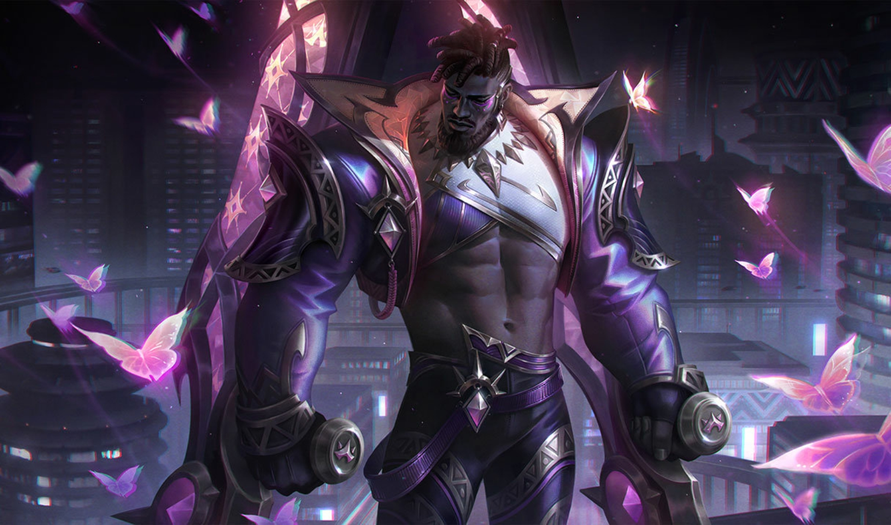
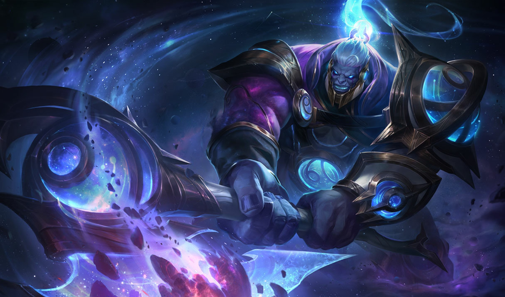
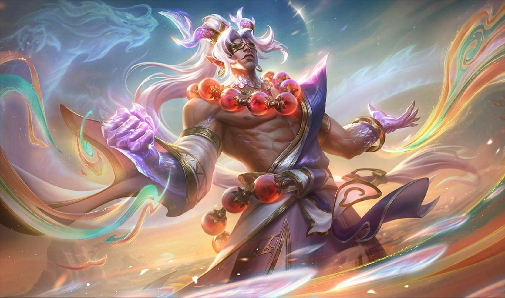
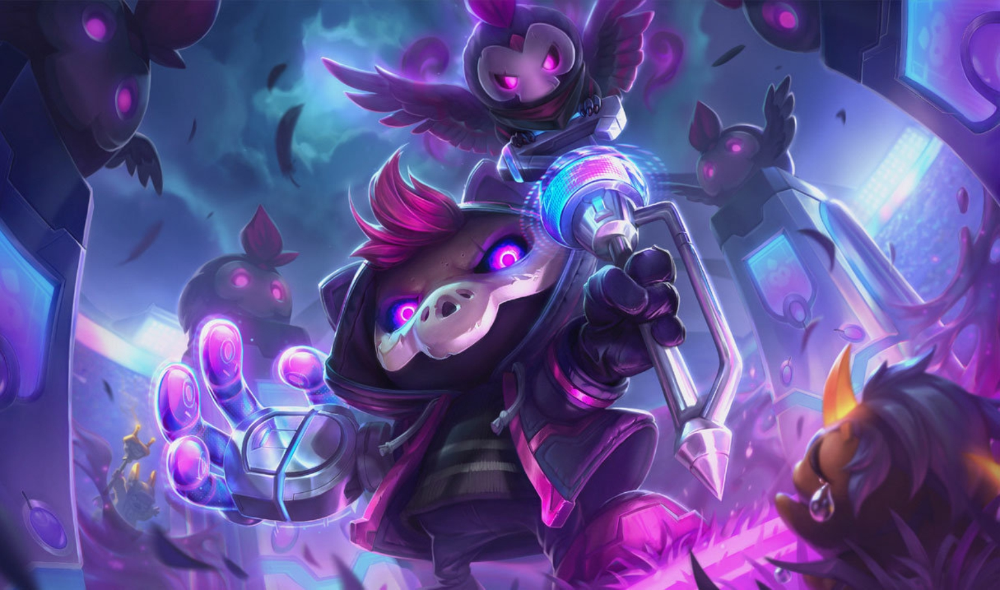
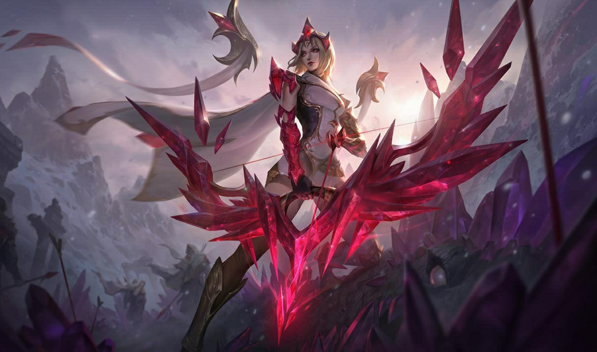
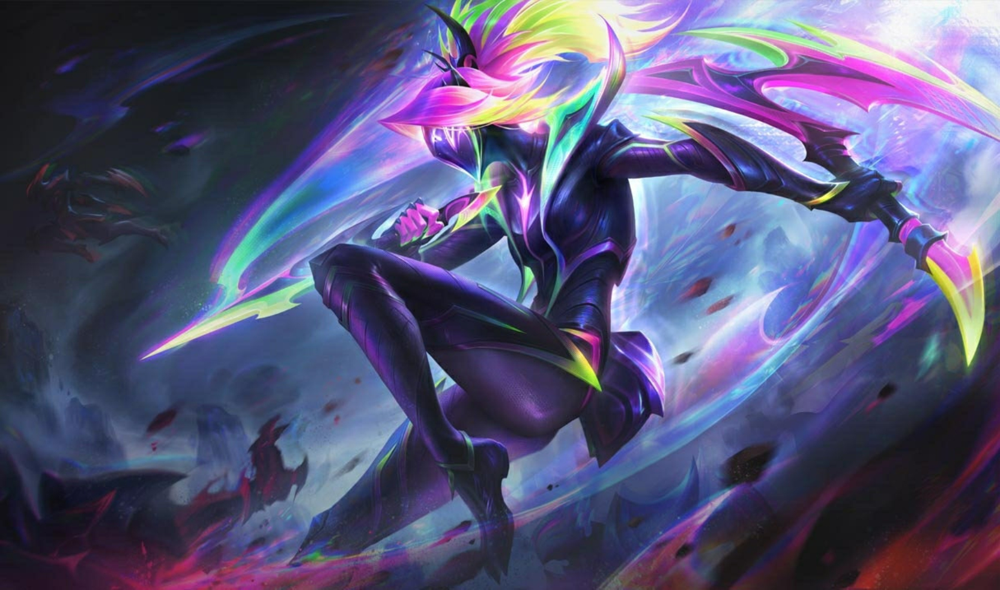

<body style="margin:0;padding:0;box-sizing:border-box;">
    <header style="background:#242424;width:100%;height:20vh;display:flex;align-items:center;justify-content:center">
        <h1 style="font-weight:800; font-family:Montserrat; text-align:center;color:#fff;">Torneio do Poder</h1>
    </header>
    <section class="heros">
        

            <h1 style="text-align:center">Personagens</h1>
            

                

                    
                    <h2 style="text-align:center;font-weight:800;font-family:Montserrat">K'Sante</h2>
                    
Defensor de Nazumah no deserto de Shurima, K'Sante lidera os Guerreiros de Pedra. Conhecido como "O Orgulho de Nazumah", ele usa armas Ntofos e luta contra ameaças e dúvidas internas.

                    <a href="#" style="display:flex;align-items:center;justify-content:center;background:#242424;padding:15px;border-radius:5px;color:#fff;font-family:Montserrat;text-decoration:none;outline:none;cursor:pointer">Jogue Agora</a>
                

                

                    
                    <h2 style="text-align:center;font-weight:800;font-family:Montserrat">Sion</h2>
                    
Guerreiro de Noxus ressuscitado como um monstro imortal. Sion é uma máquina de guerra descontrolada, lutando entre a memória de sua glória passada e sua existência brutal.

                    <a href="#" style="display:flex;align-items:center;justify-content:center;background:#242424;padding:15px;border-radius:5px;color:#fff;font-family:Montserrat;text-decoration:none;outline:none;cursor:pointer">Jogue Agora</a>
                

                

                    
                    <h2 style="text-align:center;font-weight:800;font-family:Montserrat">Lee Sin</h2>
                    
Monge de Ionia, mestre das artes marciais e da magia espiritual. Lee Sin cegou-se como penitência por seus erros passados e agora protege Ionia com sabedoria e poder.

                    <a href="#" style="display:flex;align-items:center;justify-content:center;background:#242424;padding:15px;border-radius:5px;color:#fff;font-family:Montserrat;text-decoration:none;outline:none;cursor:pointer">Jogue Agora</a>
                

                

                    
                    <h2 style="text-align:center;font-weight:800;font-family:Montserrat">Veigar</h2>
                    
Pequeno yordle com grandes ambições de ser um mestre do mal. Veigar é obcecado por magia negra e dominação, muitas vezes subestimado devido à sua aparência diminuta.

                    <a href="#" style="display:flex;align-items:center;justify-content:center;background:#242424;padding:15px;border-radius:5px;color:#fff;font-family:Montserrat;text-decoration:none;outline:none;cursor:pointer">Jogue Agora</a>
                

                

                    
                    <h2 style="text-align:center;font-weight:800;font-family:Montserrat">Ashe</h2>
                    
Arqueira de Freljord e líder da tribo Avarosana. Ashe usa um arco de gelo verdadeiro e busca unir as tribos de Freljord para trazer paz e estabilidade à sua terra. Ela é uma grande Lider

                    <a href="#" style="display:flex;align-items:center;justify-content:center;background:#242424;padding:15px;border-radius:5px;color:#fff;font-family:Montserrat;text-decoration:none;outline:none;cursor:pointer">Jogue Agora</a>
                

                

                    
                    <h2 style="text-align:center;font-weight:800;font-family:Montserrat">Akali</h2>
                    
Assassina de Ionia que deixou a Ordem Kinkou para seguir seu próprio caminho. Akali luta das sombras, usando suas habilidades ninjas para proteger sua terra de ameaças.

                    <a href="#" style="display:flex;align-items:center;justify-content:center;background:#242424;padding:15px;border-radius:5px;color:#fff;font-family:Montserrat;text-decoration:none;outline:none;cursor:pointer">Jogue Agora</a>
                

            

        

    </section>
</body>
